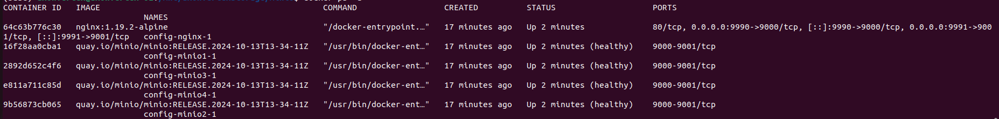

# MINIO setup on axonvertex-01

    This document contains the instructions required to set up minio on premises using docker containers

    There are two setup instructions for 
    
        1. Distributed Architecture
        2. Standalone 
    
    The following codes for docker-compose.yml and nginx.conf is for distributed architecture. 

    Before we initaite the distributed architecture , we need the directory structure. We would put 4 minio instances. 
    The logs and data will be at physical storage of the custom location of the apps. This practice can help in controlling data and logs better. 

    we will create folders and files for all necessary setups.

## DISTRIBUTED ARCHITECTURE SETUP

**command to create directories for setup**

    sudo mkdir -p /mnt/axonvertexstorage/minio/data/minio1/data1
    sudo mkdir -p /mnt/axonvertexstorage/minio/data/minio1/data2
    sudo mkdir -p /mnt/axonvertexstorage/minio/data/minio2/data1
    sudo mkdir -p /mnt/axonvertexstorage/minio/data/minio2/data2
    sudo mkdir -p /mnt/axonvertexstorage/minio/data/minio3/data1
    sudo mkdir -p /mnt/axonvertexstorage/minio/data/minio3/data2
    sudo mkdir -p /mnt/axonvertexstorage/minio/data/minio4/data1
    sudo mkdir -p /mnt/axonvertexstorage/minio/data/minio4/data2
    sudo mkdir -p /mnt/axonvertexstorage/minio/config
    sudo mkdir -p /mnt/axonvertexstorage/minio/config/logs/nginx

**command to create files for setup**

    sudo touch /mnt/axonvertexstorage/minio/config/logs/nginx/access.log
    sudo touch /mnt/axonvertexstorage/minio/config/logs/nginx/error.log
    sudo touch /mnt/axonvertexstorage/minio/config/docker-compose.yml   
    sudo touch /mnt/axonvertexstorage/minio/config/nginx.conf

**Tree Strcuture**

    /mnt/axonvertexstorage/
    └── minio/
        ├── config/
        │   ├── docker-compose.yml
        │   ├── logs/
        │   │   └── nginx/
        │   │       ├── access.log
        │   │       └── error.log
        │   └── nginx.conf
        └── data/
            ├── minio1/
            │   ├── data1/
            │   └── data2/
            ├── minio2/
            │   ├── data1/
            │   └── data2/
            ├── minio3/
            │   ├── data1/
            │   └── data2/
            └── minio4/
                ├── data1/
                └── data2/

**command to create permissions on directories and files for setup**

    sudo chown -R $(whoami):$(whoami) /mnt/axonvertexstorage/minio/data
    sudo chown -R $(whoami):$(whoami) /mnt/axonvertexstorage/minio/config

**docker-compose.yml**  - Distributed Architecture

    
    version: '3.7'

    # Common configuration for all MinIO services
    x-minio-common: &minio-common
    image: quay.io/minio/minio:RELEASE.2024-10-13T13-34-11Z
    command: server --console-address ":9001" http://minio{1...4}/data{1...2}
    expose:
        - "9000"  # MinIO API port
        - "9001"  # MinIO Console port
    environment:
        MINIO_ROOT_USER: <as_needed_uname>
        MINIO_ROOT_PASSWORD: <as_needed_pwd>
    healthcheck:
        test: ["CMD", "mc", "ready", "local"]
        interval: 5s
        timeout: 5s
        retries: 5

    services:
    minio1:
        <<: *minio-common
        hostname: minio1
        volumes:
        - /mnt/axonvertexstorage/minio/data/minio1/data1:/data1
        - /mnt/axonvertexstorage/minio/data/minio1/data2:/data2

    minio2:
        <<: *minio-common
        hostname: minio2
        volumes:
        - /mnt/axonvertexstorage/minio/data/minio2/data1:/data1
        - /mnt/axonvertexstorage/minio/data/minio2/data2:/data2

    minio3:
        <<: *minio-common
        hostname: minio3
        volumes:
        - /mnt/axonvertexstorage/minio/data/minio3/data1:/data1
        - /mnt/axonvertexstorage/minio/data/minio3/data2:/data2

    minio4:
        <<: *minio-common
        hostname: minio4
        volumes:
        - /mnt/axonvertexstorage/minio/data/minio4/data1:/data1
        - /mnt/axonvertexstorage/minio/data/minio4/data2:/data2

    nginx:
        image: nginx:1.19.2-alpine
        hostname: nginx    
        volumes:
        - /mnt/axonvertexstorage/minio/config/nginx.conf:/etc/nginx/nginx.conf:ro
        # Persist logs on the host
        - /mnt/axonvertexstorage/minio/config/logs/nginx/access.log:/var/log/nginx/access.log
        - /mnt/axonvertexstorage/minio/config/logs/nginx/error.log:/var/log/nginx/error.log
        ports:
        - "9990:9000"  # MinIO API port mapped to 9990
        - "9991:9001"  # MinIO Console port mapped to 9991
        depends_on:
        - minio1
        - minio2
        - minio3
        - minio4

**nginx.conf**  - Distributed Architecture

    user  nginx;
    worker_processes  auto;

    error_log  /var/log/nginx/error.log warn;
    pid        /var/run/nginx.pid;

    events {
        worker_connections  4096;
    }

    http {
        include       /etc/nginx/mime.types;
        default_type  application/octet-stream;

        log_format  main  '$remote_addr - $remote_user [$time_local] "$request" '
                        '$status $body_bytes_sent "$http_referer" '
                        '"$http_user_agent" "$http_x_forwarded_for"';

        access_log  /var/log/nginx/access.log  main;
        sendfile        on;
        keepalive_timeout  65;

        # include /etc/nginx/conf.d/*.conf;

        upstream minio {
            server minio1:9000;
            server minio2:9000;
            server minio3:9000;
            server minio4:9000;
        }

        upstream console {
            ip_hash;
            server minio1:9001;
            server minio2:9001;
            server minio3:9001;
            server minio4:9001;
        }

        server {
            listen       9000;
            listen  [::]:9000;
            server_name  localhost;

            # To allow special characters in headers
            ignore_invalid_headers off;
            # Allow any size file to be uploaded.
            # Set to a value such as 1000m; to restrict file size to a specific value
            client_max_body_size 0;
            # To disable buffering
            proxy_buffering off;
            proxy_request_buffering off;

            location / {
                proxy_set_header Host $http_host;
                proxy_set_header X-Real-IP $remote_addr;
                proxy_set_header X-Forwarded-For $proxy_add_x_forwarded_for;
                proxy_set_header X-Forwarded-Proto $scheme;

                proxy_connect_timeout 300;
                # Default is HTTP/1, keepalive is only enabled in HTTP/1.1
                proxy_http_version 1.1;
                proxy_set_header Connection "";
                chunked_transfer_encoding off;

                proxy_pass http://minio;
            }
        }

        server {
            listen       9001;
            listen  [::]:9001;
            server_name  localhost;

            # To allow special characters in headers
            ignore_invalid_headers off;
            # Allow any size file to be uploaded.
            # Set to a value such as 1000m; to restrict file size to a specific value
            client_max_body_size 0;
            # To disable buffering
            proxy_buffering off;
            proxy_request_buffering off;

            location / {
                proxy_set_header Host $http_host;
                proxy_set_header X-Real-IP $remote_addr;
                proxy_set_header X-Forwarded-For $proxy_add_x_forwarded_for;
                proxy_set_header X-Forwarded-Proto $scheme;
                proxy_set_header X-NginX-Proxy true;

                # This is necessary to pass the correct IP to be hashed
                real_ip_header X-Real-IP;

                proxy_connect_timeout 300;
                
                # To support websocket
                proxy_http_version 1.1;
                proxy_set_header Upgrade $http_upgrade;
                proxy_set_header Connection "upgrade";
                
                chunked_transfer_encoding off;

                proxy_pass http://console;
            }
        }
    }

#### Deploying

**Navigate to folder with docker-compose.yml file**

    cd /mnt/axonvertexstorage/minio/config

**Start the Docker Containers**

    docker-compose up -d

**Checking Services Post Deployment**

    docker ps -a

**Docker containers listing**

## STANDALONE ARCHITECTURE

For Standalone architecture, we will create two instances

1. Production Environment - prod
2. Test Environment - test

**command to create directories for setup**

    mkdir -p /mnt/axonvertexstorage/minio/data/prod/data1
    mkdir -p /mnt/axonvertexstorage/minio/data/prod/data2
    mkdir -p /mnt/axonvertexstorage/minio/data/test/data1
    mkdir -p /mnt/axonvertexstorage/minio/data/test/data2
    mkdir -p /mnt/axonvertexstorage/minio/config/logs/nginx

**command to create files for setup**

    touch /mnt/axonvertexstorage/minio/config/logs/nginx/access.log
    touch /mnt/axonvertexstorage/minio/config/logs/nginx/error.log
    touch /mnt/axonvertexstorage/minio/config/docker-compose.yml   
    touch /mnt/axonvertexstorage/minio/config/nginx.conf

**Tree Structure**

    /mnt/axonvertexstorage/
    └── minio/
        ├── config
        │   ├── docker-compose.yml
        │   ├── logs
        │   │   └── nginx
        │   │       ├── access.log
        │   │       └── error.log
        │   └── nginx.conf
        └── data
            ├── prod
            │   ├── data1
            │   └── data2
            └── test
                ├── data1
                └── data2

**command to create permissions on directories and files for setup**

    sudo chown -R $(whoami):$(whoami) /mnt/axonvertexstorage/minio/data
    sudo chown -R $(whoami):$(whoami) /mnt/axonvertexstorage/minio/config
    sudo chmod -R 755 /mnt/axonvertexstorage/minio/data
    sudo chmod -R 755 /mnt/axonvertexstorage/minio/config

**docker-compose.yml**  - Standalone Architecture

    # This docker compose file is part of Standalone Architecture deployment ( Test and Prod Setup)

        version: '3.7'

        services:
        # Production MinIO Instance - Only for final Deployment
        minio_prod:
            image: quay.io/minio/minio:RELEASE.2024-10-13T13-34-11Z
            container_name: minio_prod
            command: server --console-address ":9001" /data1 /data2
            environment:
            MINIO_ROOT_USER: minio_admin
            MINIO_ROOT_PASSWORD: admin_pwd
            volumes:
            - /mnt/axonvertexstorage/minio/data/prod/data1:/data1
            - /mnt/axonvertexstorage/minio/data/prod/data2:/data2
            ports:
            - "9000:9000"  # MinIO API port for Production
            - "9001:9001"  # MinIO Console port for Production
            healthcheck:
            test: ["CMD", "curl", "-f", "http://localhost:9000/minio/health/live"]
            interval: 30s
            timeout: 20s
            retries: 3
            restart : always

        # Testing MinIO Instance - to check with Customers and development purpose
        minio_test:
            image: quay.io/minio/minio:RELEASE.2024-10-13T13-34-11Z
            container_name: minio_test
            command: server --console-address ":9001" /data1 /data2  
            environment:
            MINIO_ROOT_USER: minio_test_admin
            MINIO_ROOT_PASSWORD: test_pwd
            volumes:
            - /mnt/axonvertexstorage/minio/data/test/data1:/data1
            - /mnt/axonvertexstorage/minio/data/test/data2:/data2
            ports:
            - "9002:9000"  # MinIO API port for Testing
            - "9003:9001"  # MinIO Console port for Testing
            healthcheck:
            test: ["CMD", "curl", "-f", "http://localhost:9000/minio/health/live"]
            interval: 30s
            timeout: 20s
            retries: 3
            restart : always

        # Nginx for Reverse Proxy
        nginx:
            image: nginx:1.19.2-alpine
            container_name: nginx
            volumes:
            - /mnt/axonvertexstorage/minio/config/nginx.conf:/etc/nginx/nginx.conf:ro     
            - /mnt/axonvertexstorage/minio/config/logs/nginx:/var/log/nginx
            
            ports:
            - "9990:9990"  # Production MinIO API mapped to 9990
            - "9991:9991"  # Production MinIO Console mapped to 9991
            - "9992:9992"  # Testing MinIO API mapped to 9992
            - "9993:9993"  # Testing MinIO Console mapped to 9993     
            depends_on:
            - minio_prod
            - minio_test
            restart : always

**nginx.conf**  - Standalone Architecture

        user  nginx;
        worker_processes  auto;

        error_log  /var/log/nginx/error.log warn;
        pid        /var/run/nginx.pid;

        events {
            worker_connections  4096;
        }

        http {
            include       /etc/nginx/mime.types;
            default_type  application/octet-stream;

            log_format  main  '$remote_addr - $remote_user [$time_local] "$request" '
                            '$status $body_bytes_sent "$http_referer" '
                            '"$http_user_agent" "$http_x_forwarded_for"';

            access_log  /var/log/nginx/access.log  main;

            sendfile        on;
            keepalive_timeout  65;

            # Server block for Production MinIO API
            server {
                listen       9990;
                server_name  localhost;

                
                ignore_invalid_headers off;

                # We can restrict the file size here. 
                client_max_body_size 0;

                # For Buffering . Change after testing. 
                proxy_buffering off;
                proxy_request_buffering off;

                location / {
                    proxy_set_header Host $http_host;
                    proxy_set_header X-Real-IP $remote_addr;
                    proxy_set_header X-Forwarded-For $proxy_add_x_forwarded_for;
                    proxy_set_header X-Forwarded-Proto $scheme;

                    proxy_connect_timeout 300;
                    proxy_http_version 1.1;
                    proxy_set_header Connection "";
                    chunked_transfer_encoding off;

                    proxy_pass http://minio_prod:9000;
                }
            }

            # Server block for Production MinIO Console
            server {
                listen       9991;
                server_name  localhost;

                
                ignore_invalid_headers off;
                
                client_max_body_size 0;
                
                proxy_buffering off;
                proxy_request_buffering off;

                location / {
                    proxy_set_header Host $http_host;
                    proxy_set_header X-Real-IP $remote_addr;
                    proxy_set_header X-Forwarded-For $proxy_add_x_forwarded_for;
                    proxy_set_header X-Forwarded-Proto $scheme;
                    proxy_set_header X-NginX-Proxy true;

                    
                    real_ip_header X-Real-IP;

                    proxy_connect_timeout 300;

                    
                    proxy_http_version 1.1;
                    proxy_set_header Upgrade $http_upgrade;
                    proxy_set_header Connection "upgrade";

                    chunked_transfer_encoding off;

                    proxy_pass http://minio_prod:9001;
                }
            }

            # Server block for Testing MinIO API
            server {
                listen       9992;
                server_name  localhost;

                
                ignore_invalid_headers off;

                
                client_max_body_size 0;

                
                proxy_buffering off;
                proxy_request_buffering off;

                location / {
                    proxy_set_header Host $http_host;
                    proxy_set_header X-Real-IP $remote_addr;
                    proxy_set_header X-Forwarded-For $proxy_add_x_forwarded_for;
                    proxy_set_header X-Forwarded-Proto $scheme;

                    proxy_connect_timeout 300;
                    proxy_http_version 1.1;
                    proxy_set_header Connection "";
                    chunked_transfer_encoding off;

                    proxy_pass http://minio_test:9000;
                }
            }

            
            server {
                listen       9993;
                server_name  localhost;

                
                ignore_invalid_headers off;

                
                client_max_body_size 0;

                
                proxy_buffering off;
                proxy_request_buffering off;

                location / {
                    proxy_set_header Host $http_host;
                    proxy_set_header X-Real-IP $remote_addr;
                    proxy_set_header X-Forwarded-For $proxy_add_x_forwarded_for;
                    proxy_set_header X-Forwarded-Proto $scheme;
                    proxy_set_header X-NginX-Proxy true;

                    #
                    real_ip_header X-Real-IP;

                    proxy_connect_timeout 300;

                    # If WebSocket connections 
                    proxy_http_version 1.1;
                    proxy_set_header Upgrade $http_upgrade;
                    proxy_set_header Connection "upgrade";

                    chunked_transfer_encoding off;

                    proxy_pass http://minio_test:9001;
                }
            }
        }

#### Deploying

**Navigate to folder with docker-compose.yml file**

    cd /mnt/axonvertexstorage/minio/config

**Start the Docker Containers**

    docker-compose up -d

**Checking Services Post Deployment**

    docker ps -a

**Docker containers listing**

    

**Access Links**

    Production MinIO API: http://localhost:9990
    Production MinIO Console: http://localhost:9991   
    Testing MinIO API: http://localhost:9992
    Testing MinIO Console: http://localhost:9993    

